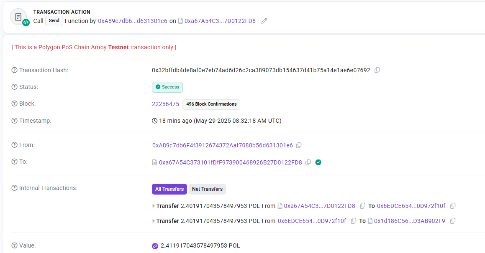
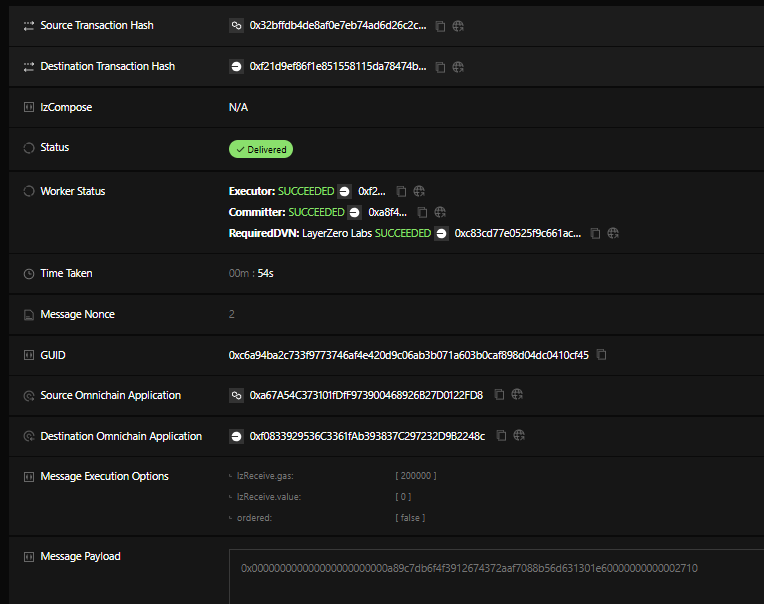
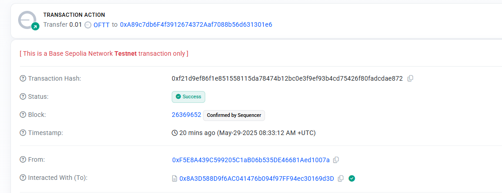
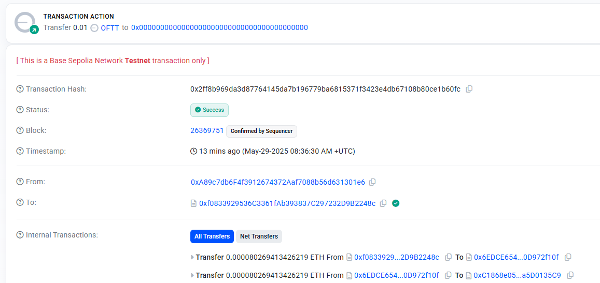
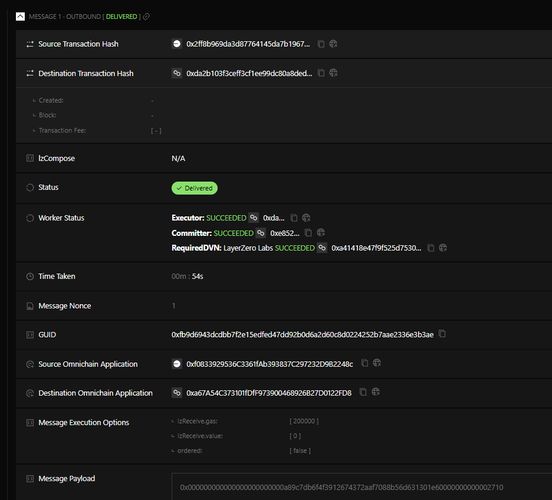
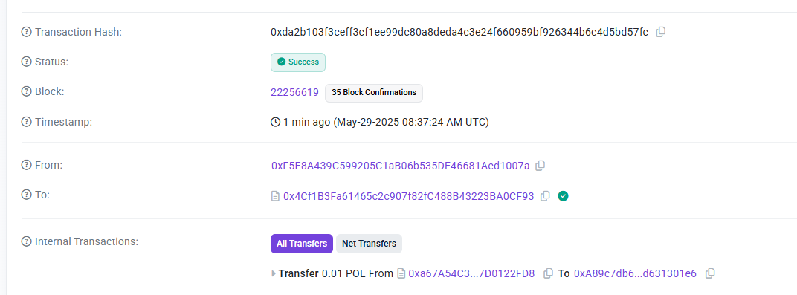

# Layerzero native token adapter

## Deploy
Copy the `.env.example` file to `.env` and fills with parameters. You can get EID for networks and endpoints here: https://docs.layerzero.network/v2/deployments/deployed-contracts

The "first network" is the one chosen when running the script with the following command:

`npx hardhat run ./scripts/deployAndSetup.ts --network <network_name>`

Where network_name is defined in `hardhat.config.ts`, for example `amoy-testnet`.

The script will deploy contracts on both chain (the second one is defined by the RPC url in `.env`) and run setup methods. Ensure to have enough gas on deployer keys on both networks.

## Test
To run a test that triggers a transfer from native chain to other chain and viceversa, fill the `.env` file with the deployed addresses logged by the above deploy script, and with a TEST_VALUE (in ETH) to transfer; then execute the following commands

1) Run from Native chain to second chain
`npx hardhat run ./scripts/runTestNativeToOft.ts --network <network_name>`

2) Run from second chain to Native one
`npx hardhat run ./scripts/runTestOftToNative.ts --network <network_name>`

Between 1 and 2, wait some minutes to be sure LayerZero completed their transactions to mint the tokens on the second chain 

The scripts will log all the sent transaction IDs.
Ensure you have enough gas on both chain to perform operation. Also, on the "first chain" you will need enough value to fill the chosen TEST_VALUE. It is suggested to use TEST_VALUE >= 0.01 to avoid dust errors due to small amounts when using chains whose gas currencies have an high difference in price (i.e. Polygon and Ethereum).

Check the `runTest` scripts to see the needed methods to invoke to perform a transfer on both sides for a Front-End implementation.

# Executed Test (Polygon Amoy and Base Sepolia)

```
npx hardhat run scripts/deployAndSetup.ts --network amoy-testnet

First Network: amoy-testnet
Deployer: 0xA89c7db6F4f3912674372Aaf7088b56d631301e6
Deployed contract: "MyNativeOFTAdapter", network: amoy-testnet, address: 0xa67A54C373101fDfF973900468926B27D0122FD8
Second Network RPC: https://sepolia.base.org
Deployer: 0xA89c7db6F4f3912674372Aaf7088b56d631301e6
Deployed contract: "MyOFT", network: https://sepolia.base.org, address: 0xf0833929536C3361fAb393837C297232D9B2248c
setup tx on first chain: 0x369612730dd5eb8d1d450e82d36b01936a355126faf840c3188703b939d46205
setup tx on second chain: 0x93e487c7a853f1b7bdcb95d6b4170a083734dfbe2474d6136ff7cf20e4b115ac
```

```
npx hardhat run ./scripts/runTestNativeToOft.ts --network amoy-testnet

Using contract: "MyNativeOFTAdapter", network: amoy-testnet, address: 0xa67A54C373101fDfF973900468926B27D0122FD8
sending value 10000000000000000 from native to oft
tx id: 0x32bffdb4de8af0e7eb74ad6d26c2ca389073db154637d41b75a14e1ae6e07692
```

```
npx hardhat run ./scripts/runTestOftToNative.ts --network amoy-testnet

Using contract: "MyOFT", network: https://sepolia.base.org, address: 0xf0833929536C3361fAb393837C297232D9B2248c
sending value 10000000000000000 from oft to native
tx id: 0x2ff8b969da3d87764145da7b196779ba6815371f3423e4db67108b80ce1b60fc

```

You also check the transactions and addresses on Scans:
- Contract on Polygon Amoy: [0xa67A54C373101fDfF973900468926B27D0122FD8](https://amoy.polygonscan.com/address/0xa67A54C373101fDfF973900468926B27D0122FD8)
- Setup TX on Polygon Amoy: [0x369612730dd5eb8d1d450e82d36b01936a355126faf840c3188703b939d46205](https://amoy.polygonscan.com/tx/0x369612730dd5eb8d1d450e82d36b01936a355126faf840c3188703b939d46205)
- Contract on Base Sepolia: [0xf0833929536C3361fAb393837C297232D9B2248c](https://sepolia.basescan.org/address/0xf0833929536C3361fAb393837C297232D9B2248c)
- Setup TX on Base Sepolia: [0x93e487c7a853f1b7bdcb95d6b4170a083734dfbe2474d6136ff7cf20e4b115ac](https://sepolia.basescan.org/tx/0x93e487c7a853f1b7bdcb95d6b4170a083734dfbe2474d6136ff7cf20e4b115ac)
- Native Amoy -> Base Sepolia on Polygonscan: [0x32bffdb4de8af0e7eb74ad6d26c2ca389073db154637d41b75a14e1ae6e07692](https://amoy.polygonscan.com/tx/0x32bffdb4de8af0e7eb74ad6d26c2ca389073db154637d41b75a14e1ae6e07692)
- Native Amoy -> Base Sepolia on LayerZeroScan: https://testnet.layerzeroscan.com/tx/0x73a4be6f28fc5e112ca426f0fef3e23c4d2231854dee84997406a715c95b2739
- Base Sepolia -> Native Amoy on Basescan: [0x2ff8b969da3d87764145da7b196779ba6815371f3423e4db67108b80ce1b60fc](https://sepolia.basescan.org/tx/0x2ff8b969da3d87764145da7b196779ba6815371f3423e4db67108b80ce1b60fc)
- Base Sepolia -> Native Amoy on LayerZeroScan: https://testnet.layerzeroscan.com/tx/0xe097fac41c5d986ce4546d237a526b876439b3757b33c37f17c7363835dc3f24

## Native to OFT

When running the first script, to transfer native POL from Polygon Amoy network to Base Sepolia network, the `send` method on the `MyNativeOFTAdapter` contract is invoked. In the parameters, the `EID` of the destination chain (Base Sepolia) is specified. Please note that there's no need to specify the destination address since it was already set in the setup phase with the `setPeer` method.

The transaction on Amoy Polygonscan:



This transaction transfers the POL tokens as `value` of the transaction: the transfered `value` is equal to the amount to transfer + the fee by the network. In this case we are transferring 0.01 POL, but the fee is very high due to the difference in price between Polygon Amoy and Base Sepolia. In fact, the `value` transferred here should also cover the fees that LayerZero nodes will pay to send the transaction on the destination chain. The paid fee is influcenced by the gas price on destination chain and also by the conversion rate of the involved gas-paying currencies (POL on Polygon, ETH on Base).

This Polygon transaction triggers a LayerZero transaction:



As we can see on LayerZero scan, the message payload contains both the destination address (`0xA89c7db6F4f3912674372Aaf7088b56d631301e6`, in the middle on the message without `0x` and in lowercase) and the transfer value (at the end of the message).
Also, we see our Polygon transaction as Source Transaction Hash and a Base transaction in the Destination Transaction Hash

We can check on Sepolia Basescan what happened with the Destination Transaction:



As expected, the transaction minted 0.01 of the OFTT token (`MyOFT` contract instance) that was linked to the `MyNativeOFTAdapter` contract on Polygon.

## OFT to Native

When running the second script, to transfer OFTT token from Base Sepolia network to native POL in Polygon Amoy Network, the same `send` method is invoked, this time on the `MyOFT` contract deployed on Base Sepolia Network. Since on Base Sepolia this token exists as `ERC20`, it will be transferred internally in the method, while the `value` attached to the transaction is needed to cover the fees of the transaction that LayerZero will then run on the destination chain.

We can check the transaction on Sepolia Basescan:



As we can see, the transaction burned 0.01 OFTT from the sender account, since now they should not exist anymore on the Base Sepolia chain.

Searching the transaction on LayerZero Scan, we can see this:



Again, we see in the message payload the destination address and the value to transfer, and in the Destination Transaction Hash we have the hash of a Amoy Polygon transaction, that we can check in Polygonscan:



As expected, the transaction on Polygonscan shows that 0.01 POL (native) were sent to the destination address, completing the flow.
